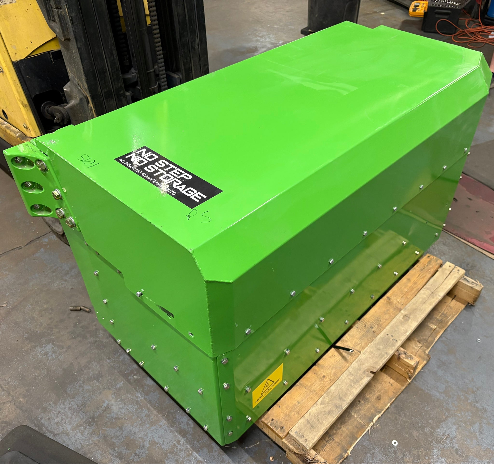
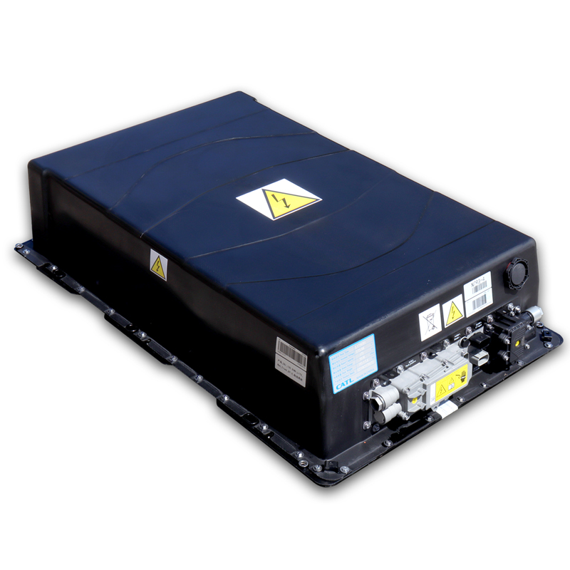
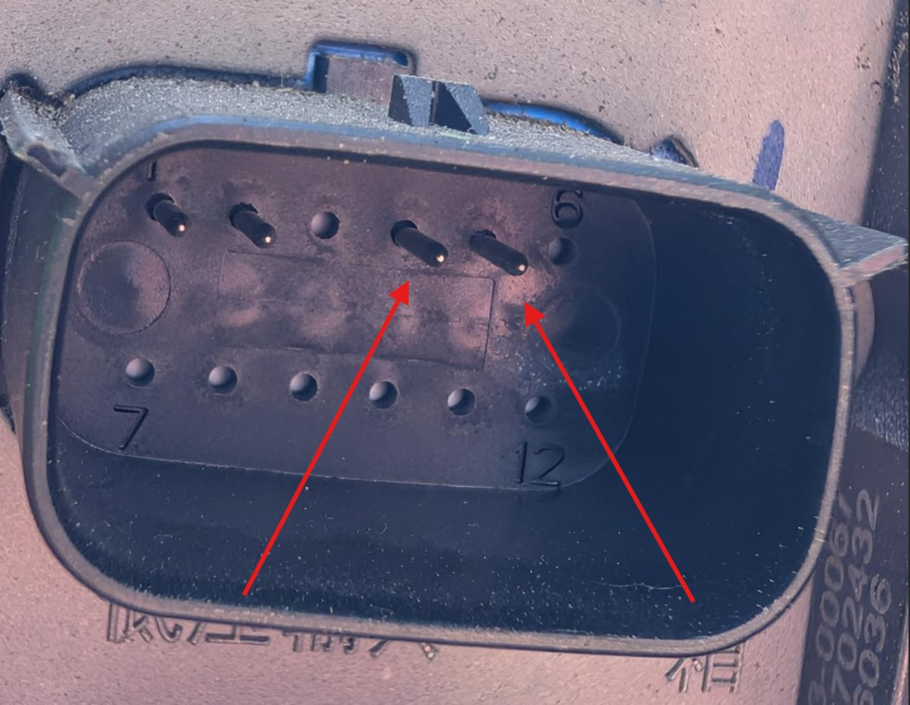

# Behemoth-ESP32

**ESP32 isoSPI assertion harness for CATL 63S LFP battery packs**





## What Is This?

Behemoth-ESP32 is closed-source firmware for an ESP32 microcontroller that monitors and validates Hyliion 104kWh "Behemoth" lithium iron phosphate (LiFePO4) battery packs made of 3× 63S CATL 3.2V 173Ah LiFePO4 enclosures via the Analog Devices LTC6812-1 battery monitor IC family. It communicates over an isolated SPI (isoSPI) daisy chain through an LTC6820 transceiver, reading cell voltages, temperatures, and diagnostic registers from up to 15 ICs (3 enclosures / 189 cells in series).

The firmware is an **interactive assertion harness**; not a continuous-polling BMS loop. It issues no SPI traffic at boot and performs no autonomous actions. Every chain operation is triggered explicitly by a human operator via a command-line interface, making it safe for bench characterization, commissioning, and fault diagnosis of high-voltage battery stacks. The harness auto-detects and works with 63S (1 enclosure), 126S (2 enclosures), and 189S (3 enclosures) serial chain configurations.

The LTC6812-1 includes internal N-channel MOSFETs for each cell that can sink current through an on-board discharge resistor. This discharge capability is not yet exposed in the firmware. The passivity invariant actively zeroes all DCC and DCTO bits on every configuration write, ensuring no cell discharge can occur. A future firmware increment will add a guarded command menu for controlled per-cell discharge with timed auto-shutoff via DCTO.

## The Battery

The Hyliion "Behemoth" is a 104 kWh lithium iron phosphate battery pack. Each green Hyliion box contains 3× black CATL 63S enclosures in series (189S total, ~604.8 V nominal). Each CATL enclosure contains 63 series-connected 3.2V 173Ah LiFePO4 prismatic cells (~201.6 V nominal, ~34.7 kWh per enclosure). Within each CATL enclosure, the cells are monitored by 5 daisy-chained LTC6812-1 battery monitor ICs on the internal BMS boards, with a specific population mask:

| IC | Active Cells | Mask | Empty Channels |
|----|-------------|------|----------------|
| IC1–IC3 | 13 each | `0x3FEF` | C5, C15 |
| IC4–IC5 | 12 each | `0x1FEF` | C5, C14, C15 |
| **Total** | **63 cells** | | 3×13 + 2×12 = 63S |

Multiple modules can be series-connected:

| Configuration | Enclosures | Cells | ICs | Nominal Voltage |
|--------------|-----------|-------|-----|-----------------|
| `CATL_63S` | 1 | 63 | 5 | ~201.6 V |
| `CATL_126S` | 2 | 126 | 10 | ~403.2 V |
| `CATL_189S` | 3 | 189 | 15 | ~604.8 V |

## Hardware Platform

| Component | Part | Role |
|-----------|------|------|
| MCU | ESP32-WROOM-32 | WiFi + dual-core + SPI master |
| isoSPI transceiver | LTC6820 (DC1941D eval board) | Galvanic isolation, SPI ↔ isoSPI |
| Battery monitors | LTC6812-1 (×5 per enclosure) | 15-channel cell voltage + 9 GPIO/thermistor ADC |
| Thermistors | NTC 10kΩ @ 25°C, β=3950 (assumed) | Temperature sensing via GPIO voltage dividers |

**SPI bus**: 1 MHz, MODE3, MSBFIRST; SCK=GPIO18, MISO=GPIO19, MOSI=GPIO23, CS=GPIO5.

## Capabilities

The `info` command should be run first. It wakes the entire chain with 15 pulses (enough for a full 189S / 3-enclosure stack), reads RDCFGA and RDCFGB from all responding ICs, and counts how many return valid PEC15 checksums. This detects the pack serialization; 5 ICs = 63S (1 enclosure), 10 ICs = 126S (2 enclosures), 15 ICs = 189S (3 enclosures); and reports whether the detected count matches the firmware build target. It outputs:

- Build configuration (compiled IC count and expected enclosure count)
- Network status (WiFi mode and IP address)
- SPI bus parameters (clock, mode, pin assignments)
- Chain detection result: detected vs. expected IC count, with MATCH / SHORT / NO CHIPS RESPONDING diagnostics
- Raw RDCFGA and RDCFGB register dumps for every IC (6 data bytes + PEC, with PEC-OK / PEC-BAD / all-FF status)
- SPI transfer timing (microseconds per register read)
- Passivity audit: confirms all DCC and DCTO bits read back as zero across every IC


<details><summary>Example output (63S, 1 enclosure)</summary>

```
---- info ----
  build: BEHEMOTH_TOTAL_IC=5  BEHEMOTH_TEST_HARNESS=1
  chain: 5 IC (1 CATL enclosure(s) expected)
  net:   mode=STA  ip=192.168.13.1
  SPI:   1000000 Hz, MODE3, MSBFIRST  SCK=18 MISO=19 MOSI=23 CS=5
[+   8ms] wakeup_sleep + wakeup_idle done (probed 15 IC)
[+  11ms] chain detection: detected=5 expected=5  MATCH
[+  14ms] RDCFGA TX: 00 02 2B 0A  (PEC=2B0A)  transfer 1286us
  IC1: 02 00 00 00 00 00 | pec_rx=BAA2 calc=BAA2  [PEC-OK]
  IC2: 02 00 00 00 00 00 | pec_rx=BAA2 calc=BAA2  [PEC-OK]
  IC3: 02 00 00 00 00 00 | pec_rx=BAA2 calc=BAA2  [PEC-OK]
  IC4: 02 00 00 00 00 00 | pec_rx=BAA2 calc=BAA2  [PEC-OK]
  IC5: 02 00 00 00 00 00 | pec_rx=BAA2 calc=BAA2  [PEC-OK]
[+  43ms] RDCFGB TX: 00 26 2C C8  (PEC=2CC8)  transfer 1283us
  IC1: 00 00 00 00 00 00 | pec_rx=C212 calc=C212  [PEC-OK]
  IC2: 00 00 00 00 00 00 | pec_rx=C212 calc=C212  [PEC-OK]
  IC3: 00 00 00 00 00 00 | pec_rx=C212 calc=C212  [PEC-OK]
  IC4: 00 00 00 00 00 00 | pec_rx=C212 calc=C212  [PEC-OK]
  IC5: 00 00 00 00 00 00 | pec_rx=C212 calc=C212  [PEC-OK]
[+  83ms] RDCFGA pec_bad=0/5  RDCFGB pec_bad=0/5
  passivity audit (DCC1..16, DCC0, DCTO must all be 0):
  IC1 CFGA[4]=00 CFGA[5]=00 CFGB[0]=00 CFGB[1]=00  DCC1..8=00 DCC9..12=0 DCTO=0 DCC13..16=0 DCC0=0  PASSIVE
  IC2 CFGA[4]=00 CFGA[5]=00 CFGB[0]=00 CFGB[1]=00  DCC1..8=00 DCC9..12=0 DCTO=0 DCC13..16=0 DCC0=0  PASSIVE
  IC3 CFGA[4]=00 CFGA[5]=00 CFGB[0]=00 CFGB[1]=00  DCC1..8=00 DCC9..12=0 DCTO=0 DCC13..16=0 DCC0=0  PASSIVE
  IC4 CFGA[4]=00 CFGA[5]=00 CFGB[0]=00 CFGB[1]=00  DCC1..8=00 DCC9..12=0 DCTO=0 DCC13..16=0 DCC0=0  PASSIVE
  IC5 CFGA[4]=00 CFGA[5]=00 CFGB[0]=00 CFGB[1]=00  DCC1..8=00 DCC9..12=0 DCTO=0 DCC13..16=0 DCC0=0  PASSIVE
  passivity: OK
```
 </details>
  
 <details><summary>Example output (126S, 2 enclosures detection)</summary>
 
 ```
  ---- info ----
  build: BEHEMOTH_TOTAL_IC=5  CHAIN_MAX_IC=15  BEHEMOTH_TEST_HARNESS=1
  chain: default=5 IC (1 CATL enclosure(s)), active=5 IC (1 enclosure(s))
  valid runtime chain counts: 5 / 10 / 15 IC (1..3 enclosures)
  net:   mode=STA  ip=192.168.13.1
  SPI:   1000000 Hz, MODE3, MSBFIRST  SCK=18 MISO=19 MOSI=23 CS=5
chain: SPI bus configured, bms_ics[] init+sanitized (no isoSPI traffic issued yet)
[+   8ms] wakeup_sleep + wakeup_idle done (probed 15 IC)
[+  11ms] chain detection: detected=10 default=5 active_now=10  *** LONGER THAN DEFAULT -- runtime override applied ***
[+  24ms] active chain update: previous=5 -> current=10 IC
[+  28ms] RDCFGA TX: 00 02 2B 0A  (PEC=2B0A)  transfer 1286us
  IC1: 02 00 00 00 00 00 | pec_rx=BAA2 calc=BAA2  [PEC-OK]
  IC2: 02 00 00 00 00 00 | pec_rx=BAA2 calc=BAA2  [PEC-OK]
  IC3: 02 00 00 00 00 00 | pec_rx=BAA2 calc=BAA2  [PEC-OK]
  IC4: 02 00 00 00 00 00 | pec_rx=BAA2 calc=BAA2  [PEC-OK]
  IC5: 02 00 00 00 00 00 | pec_rx=BAA2 calc=BAA2  [PEC-OK]
  IC6: 02 00 00 00 00 00 | pec_rx=BAA2 calc=BAA2  [PEC-OK]
  IC7: 02 00 00 00 00 00 | pec_rx=BAA2 calc=BAA2  [PEC-OK]
  IC8: 02 00 00 00 00 00 | pec_rx=BAA2 calc=BAA2  [PEC-OK]
  IC9: 02 00 00 00 00 00 | pec_rx=BAA2 calc=BAA2  [PEC-OK]
  IC10: 02 00 00 00 00 00 | pec_rx=BAA2 calc=BAA2  [PEC-OK]
[+  85ms] RDCFGB TX: 00 26 2C C8  (PEC=2CC8)  transfer 1281us
  IC1: 00 00 00 00 00 00 | pec_rx=C212 calc=C212  [PEC-OK]
  IC2: 00 00 00 00 00 00 | pec_rx=C212 calc=C212  [PEC-OK]
  IC3: 00 00 00 00 00 00 | pec_rx=C212 calc=C212  [PEC-OK]
  IC4: 00 00 00 00 00 00 | pec_rx=C212 calc=C212  [PEC-OK]
  IC5: 00 00 00 00 00 00 | pec_rx=C212 calc=C212  [PEC-OK]
  IC6: 00 00 00 00 00 00 | pec_rx=C212 calc=C212  [PEC-OK]
  IC7: 00 00 00 00 00 00 | pec_rx=C212 calc=C212  [PEC-OK]
  IC8: 00 00 00 00 00 00 | pec_rx=C212 calc=C212  [PEC-OK]
  IC9: 00 00 00 00 00 00 | pec_rx=C212 calc=C212  [PEC-OK]
  IC10: 00 00 00 00 00 00 | pec_rx=C212 calc=C212  [PEC-OK]
[+ 147ms] RDCFGA pec_bad=0/10  RDCFGB pec_bad=0/10
  passivity audit (DCC1..16, DCC0, DCTO must all be 0):
  IC1 CFGA[4]=00 CFGA[5]=00 CFGB[0]=00 CFGB[1]=00  DCC1..8=00 DCC9..12=0 DCTO=0 DCC13..16=0 DCC0=0  PASSIVE
  IC2 CFGA[4]=00 CFGA[5]=00 CFGB[0]=00 CFGB[1]=00  DCC1..8=00 DCC9..12=0 DCTO=0 DCC13..16=0 DCC0=0  PASSIVE
  IC3 CFGA[4]=00 CFGA[5]=00 CFGB[0]=00 CFGB[1]=00  DCC1..8=00 DCC9..12=0 DCTO=0 DCC13..16=0 DCC0=0  PASSIVE
  IC4 CFGA[4]=00 CFGA[5]=00 CFGB[0]=00 CFGB[1]=00  DCC1..8=00 DCC9..12=0 DCTO=0 DCC13..16=0 DCC0=0  PASSIVE
  IC5 CFGA[4]=00 CFGA[5]=00 CFGB[0]=00 CFGB[1]=00  DCC1..8=00 DCC9..12=0 DCTO=0 DCC13..16=0 DCC0=0  PASSIVE
  IC6 CFGA[4]=00 CFGA[5]=00 CFGB[0]=00 CFGB[1]=00  DCC1..8=00 DCC9..12=0 DCTO=0 DCC13..16=0 DCC0=0  PASSIVE
  IC7 CFGA[4]=00 CFGA[5]=00 CFGB[0]=00 CFGB[1]=00  DCC1..8=00 DCC9..12=0 DCTO=0 DCC13..16=0 DCC0=0  PASSIVE
  IC8 CFGA[4]=00 CFGA[5]=00 CFGB[0]=00 CFGB[1]=00  DCC1..8=00 DCC9..12=0 DCTO=0 DCC13..16=0 DCC0=0  PASSIVE
  IC9 CFGA[4]=00 CFGA[5]=00 CFGB[0]=00 CFGB[1]=00  DCC1..8=00 DCC9..12=0 DCTO=0 DCC13..16=0 DCC0=0  PASSIVE
  IC10 CFGA[4]=00 CFGA[5]=00 CFGB[0]=00 CFGB[1]=00  DCC1..8=00 DCC9..12=0 DCTO=0 DCC13..16=0 DCC0=0  PASSIVE
  passivity: OK
```
</details>


### Cell Voltage Monitoring: `cell` / `cellraw`
- Broadcast ADCV conversion + per-register RDCV reads (RDCVA–RDCVE)
- All 5 register groups read individually with per-IC PEC15 validation
- CATL population mask applied; empty channels verified near 0V
- Pack-level statistics: total voltage, min/max/delta, per-IC subtotals
- `cellraw` adds raw MISO byte dump for each register read

> **Pass**: Every IC on the chain is responding, the ADC is converting correctly, and all populated cells are reading within the LFP voltage window. The population mask matches the expected CATL wiring; no phantom cells, no missing channels.
>
> **Fail**: PEC errors indicate communication corruption (bad wiring, noise, or a dead IC). Cells reading 0V on populated channels suggest an open wire or a failed sense connection. Voltages outside the 2.5–3.65V LFP window flag cells that are over/under-charged or have degraded capacity.

<details><summary>Example output (63S, 1 enclosure, PASS)</summary>

```
---- cell voltages ----
  build: BEHEMOTH_TOTAL_IC=5  enclosures=1
  mode:  MD_7KHZ_3KHZ  DCP=disabled  CH=all
  timing: ADCV@+7ms  RDCV@+17ms  done@+21ms  (rdcv pec_total=0)
  per-IC PEC: IC1 OK IC2 OK IC3 OK IC4 OK IC5 OK

  pack:  209.503 V   (63 cells across 1 enclosure(s) / 5 IC)
  min:   3.2450 V   cell #14 (IC2 C1)
  max:   3.3334 V   cell #31 (IC3 C6)
  avg:   3.3254 V
  delta: 0.0884 V

  IC1 (s1..s13, mask 0x3FEF, 13 populated):  sum=43.231V
    s1  (C1 )=3.2465 s2  (C2 )=3.3320 s3  (C3 )=3.3324 s4  (C4 )=3.3325
    s5  (C6 )=3.3324 s6  (C7 )=3.3328 s7  (C8 )=3.3327 s8  (C9 )=3.3329
    s9  (C10)=3.3327 s10 (C11)=3.3312 s11 (C12)=3.3307 s12 (C13)=3.3312
    s13 (C14)=3.3310
  IC2 (s14..s26, mask 0x3FEF, 13 populated):  sum=43.230V
    s14 (C1 )=3.2450 s15 (C2 )=3.3320 s16 (C3 )=3.3324 s17 (C4 )=3.3323
    s18 (C6 )=3.3328 s19 (C7 )=3.3327 s20 (C8 )=3.3328 s21 (C9 )=3.3325
    s22 (C10)=3.3325 s23 (C11)=3.3311 s24 (C12)=3.3316 s25 (C13)=3.3314
    s26 (C14)=3.3313
  IC3 (s27..s39, mask 0x3FEF, 13 populated):  sum=43.242V
    s27 (C1 )=3.2492 s28 (C2 )=3.3328 s29 (C3 )=3.3333 s30 (C4 )=3.3333
    s31 (C6 )=3.3334 s32 (C7 )=3.3333 s33 (C8 )=3.3332 s34 (C9 )=3.3325
    s35 (C10)=3.3330 s36 (C11)=3.3317 s37 (C12)=3.3323 s38 (C13)=3.3320
    s39 (C14)=3.3319
  IC4 (s40..s51, mask 0x1FEF, 12 populated):  sum=39.902V
    s40 (C1 )=3.2486 s41 (C2 )=3.3319 s42 (C3 )=3.3323 s43 (C4 )=3.3324
    s44 (C6 )=3.3331 s45 (C7 )=3.3327 s46 (C8 )=3.3328 s47 (C9 )=3.3318
    s48 (C10)=3.3329 s49 (C11)=3.3306 s50 (C12)=3.3318 s51 (C13)=3.3313
  IC5 (s52..s63, mask 0x1FEF, 12 populated):  sum=39.898V
    s52 (C1 )=3.2461 s53 (C2 )=3.3317 s54 (C3 )=3.3322 s55 (C4 )=3.3321
    s56 (C6 )=3.3329 s57 (C7 )=3.3328 s58 (C8 )=3.3325 s59 (C9 )=3.3317
    s60 (C10)=3.3326 s61 (C11)=3.3312 s62 (C12)=3.3313 s63 (C13)=3.3307
--- End cell ---
```
</details>


<details><summary>Example output (126S, 2 enclosures, PASS)</summary>

```
---- cell voltages ----
  build: BEHEMOTH_TOTAL_IC=5  active_ic=10  enclosures=2
  mode:  MD_7KHZ_3KHZ  DCP=disabled  CH=all
  timing: ADCV@+7ms  RDCV@+18ms  done@+23ms  (rdcv pec_total=0)
  per-IC PEC: IC1 OK IC2 OK IC3 OK IC4 OK IC5 OK IC6 OK IC7 OK IC8 OK IC9 OK IC10 OK

  pack:  418.076 V   (126 cells across 2 enclosure(s) / 10 IC)
  min:   3.2970 V   cell #64 (IC6 C1)
  max:   3.3338 V   cell #33 (IC3 C8)
  avg:   3.3181 V
  delta: 0.0368 V

  IC1 (s1..s13, mask 0x3FEF, 13 populated):  sum=43.313V
    s1  (C1 )=3.3274 s2  (C2 )=3.3324 s3  (C3 )=3.3326 s4  (C4 )=3.3325
    s5  (C6 )=3.3324 s6  (C7 )=3.3329 s7  (C8 )=3.3328 s8  (C9 )=3.3324
    s9  (C10)=3.3325 s10 (C11)=3.3316 s11 (C12)=3.3310 s12 (C13)=3.3314
    s13 (C14)=3.3307
  IC2 (s14..s26, mask 0x3FEF, 13 populated):  sum=43.312V
    s14 (C1 )=3.3272 s15 (C2 )=3.3323 s16 (C3 )=3.3323 s17 (C4 )=3.3325
    s18 (C6 )=3.3325 s19 (C7 )=3.3330 s20 (C8 )=3.3330 s21 (C9 )=3.3323
    s22 (C10)=3.3320 s23 (C11)=3.3316 s24 (C12)=3.3315 s25 (C13)=3.3316
    s26 (C14)=3.3305
  IC3 (s27..s39, mask 0x3FEF, 13 populated):  sum=43.321V
    s27 (C1 )=3.3282 s28 (C2 )=3.3329 s29 (C3 )=3.3330 s30 (C4 )=3.3331
    s31 (C6 )=3.3332 s32 (C7 )=3.3336 s33 (C8 )=3.3338 s34 (C9 )=3.3325
    s35 (C10)=3.3326 s36 (C11)=3.3321 s37 (C12)=3.3319 s38 (C13)=3.3323
    s39 (C14)=3.3315
  IC4 (s40..s51, mask 0x1FEF, 12 populated):  sum=39.981V
    s40 (C1 )=3.3274 s41 (C2 )=3.3324 s42 (C3 )=3.3324 s43 (C4 )=3.3326
    s44 (C6 )=3.3326 s45 (C7 )=3.3333 s46 (C8 )=3.3333 s47 (C9 )=3.3317
    s48 (C10)=3.3322 s49 (C11)=3.3310 s50 (C12)=3.3317 s51 (C13)=3.3309
  IC5 (s52..s63, mask 0x1FEF, 12 populated):  sum=39.979V
    s52 (C1 )=3.3266 s53 (C2 )=3.3319 s54 (C3 )=3.3319 s55 (C4 )=3.3323
    s56 (C6 )=3.3323 s57 (C7 )=3.3330 s58 (C8 )=3.3331 s59 (C9 )=3.3314
    s60 (C10)=3.3321 s61 (C11)=3.3315 s62 (C12)=3.3313 s63 (C13)=3.3319
  IC6 (s64..s76, mask 0x3FEF, 13 populated):  sum=42.941V
    s64 (C1 )=3.2970 s65 (C2 )=3.3038 s66 (C3 )=3.3027 s67 (C4 )=3.3035
    s68 (C6 )=3.3041 s69 (C7 )=3.3032 s70 (C8 )=3.3043 s71 (C9 )=3.3045
    s72 (C10)=3.3037 s73 (C11)=3.3039 s74 (C12)=3.3031 s75 (C13)=3.3035
    s76 (C14)=3.3037
  IC7 (s77..s89, mask 0x3FEF, 13 populated):  sum=42.950V
    s77 (C1 )=3.2996 s78 (C2 )=3.3040 s79 (C3 )=3.3043 s80 (C4 )=3.3043
    s81 (C6 )=3.3035 s82 (C7 )=3.3031 s83 (C8 )=3.3038 s84 (C9 )=3.3033
    s85 (C10)=3.3058 s86 (C11)=3.3053 s87 (C12)=3.3055 s88 (C13)=3.3047
    s89 (C14)=3.3030
  IC8 (s90..s102, mask 0x3FEF, 13 populated):  sum=42.970V
    s90 (C1 )=3.3003 s91 (C2 )=3.3051 s92 (C3 )=3.3058 s93 (C4 )=3.3066
    s94 (C6 )=3.3059 s95 (C7 )=3.3058 s96 (C8 )=3.3066 s97 (C9 )=3.3059
    s98 (C10)=3.3061 s99 (C11)=3.3062 s100(C12)=3.3047 s101(C13)=3.3054
    s102(C14)=3.3054
  IC9 (s103..s114, mask 0x1FEF, 12 populated):  sum=39.654V
    s103(C1 )=3.3009 s104(C2 )=3.3053 s105(C3 )=3.3037 s106(C4 )=3.3031
    s107(C6 )=3.3052 s108(C7 )=3.3047 s109(C8 )=3.3051 s110(C9 )=3.3060
    s111(C10)=3.3056 s112(C11)=3.3048 s113(C12)=3.3044 s114(C13)=3.3048
  IC10 (s115..s126, mask 0x1FEF, 12 populated):  sum=39.655V
    s115(C1 )=3.2997 s116(C2 )=3.3057 s117(C3 )=3.3057 s118(C4 )=3.3052
    s119(C6 )=3.3052 s120(C7 )=3.3056 s121(C8 )=3.3054 s122(C9 )=3.3051
    s123(C10)=3.3051 s124(C11)=3.3042 s125(C12)=3.3039 s126(C13)=3.3041
--- End cell ---
```
</details>


<details><summary>Example output: <code>cellraw</code> (63S, 1 enclosure, PASS)</summary>

```
---- cellraw (raw RDCV byte dump) ----
[+21ms] wake + WRCFG + RDCFGA-verify + CLRCELL + ADCV + 10ms + RDCV(A..E) done

RDCFGA verify after WRCFG  [expect REFON=1, CFGA[0]=06]:
  IC1: 06 00 00 00 00 00 | pec_rx=4BC2 calc=4BC2 [PEC-OK]  REFON=1  (WRCFG landed)
  IC2: 06 00 00 00 00 00 | pec_rx=4BC2 calc=4BC2 [PEC-OK]  REFON=1  (WRCFG landed)
  IC3: 06 00 00 00 00 00 | pec_rx=4BC2 calc=4BC2 [PEC-OK]  REFON=1  (WRCFG landed)
  IC4: 06 00 00 00 00 00 | pec_rx=4BC2 calc=4BC2 [PEC-OK]  REFON=1  (WRCFG landed)
  IC5: 06 00 00 00 00 00 | pec_rx=4BC2 calc=4BC2 [PEC-OK]  REFON=1  (WRCFG landed)

RDCVA (C1..C3):
  IC1: D1 7E 28 82 2C 82 | pec_rx=A67E calc=A67E [PEC-OK]  C1=3.2465V C2=3.3320V C3=3.3324V
  IC2: C2 7E 28 82 2C 82 | pec_rx=3172 calc=3172 [PEC-OK]  C1=3.2450V C2=3.3320V C3=3.3324V
  IC3: EC 7E 30 82 35 82 | pec_rx=4700 calc=4700 [PEC-OK]  C1=3.2492V C2=3.3328V C3=3.3333V
  IC4: E6 7E 27 82 2B 82 | pec_rx=960A calc=960A [PEC-OK]  C1=3.2486V C2=3.3319V C3=3.3323V
  IC5: CD 7E 25 82 2A 82 | pec_rx=6446 calc=6446 [PEC-OK]  C1=3.2461V C2=3.3317V C3=3.3322V

RDCVB (C4..C6):
  IC1: 2D 82 00 00 2C 82 | pec_rx=0FE8 calc=0FE8 [PEC-OK]  C4=3.3325V C5=0.0000V C6=3.3324V
  IC2: 2B 82 00 00 30 82 | pec_rx=A56E calc=A56E [PEC-OK]  C4=3.3323V C5=0.0000V C6=3.3328V
  IC3: 35 82 00 00 36 82 | pec_rx=B164 calc=B164 [PEC-OK]  C4=3.3333V C5=0.0000V C6=3.3334V
  IC4: 2C 82 00 00 33 82 | pec_rx=0300 calc=0300 [PEC-OK]  C4=3.3324V C5=0.0000V C6=3.3331V
  IC5: 29 82 00 00 31 82 | pec_rx=5592 calc=5592 [PEC-OK]  C4=3.3321V C5=0.0000V C6=3.3329V

RDCVC (C7..C9):
  IC1: 30 82 2F 82 31 82 | pec_rx=4ADE calc=4ADE [PEC-OK]  C7=3.3328V C8=3.3327V C9=3.3329V
  IC2: 2F 82 30 82 2D 82 | pec_rx=7A10 calc=7A10 [PEC-OK]  C7=3.3327V C8=3.3328V C9=3.3325V
  IC3: 35 82 34 82 2D 82 | pec_rx=4F76 calc=4F76 [PEC-OK]  C7=3.3333V C8=3.3332V C9=3.3325V
  IC4: 2F 82 30 82 26 82 | pec_rx=9A08 calc=9A08 [PEC-OK]  C7=3.3327V C8=3.3328V C9=3.3318V
  IC5: 30 82 2D 82 25 82 | pec_rx=E196 calc=E196 [PEC-OK]  C7=3.3328V C8=3.3325V C9=3.3317V

RDCVD (C10..C12):
  IC1: 2F 82 20 82 1B 82 | pec_rx=21EA calc=21EA [PEC-OK]  C10=3.3327V C11=3.3312V C12=3.3307V
  IC2: 2D 82 1F 82 24 82 | pec_rx=B58A calc=B58A [PEC-OK]  C10=3.3325V C11=3.3311V C12=3.3316V
  IC3: 32 82 25 82 2B 82 | pec_rx=29A6 calc=29A6 [PEC-OK]  C10=3.3330V C11=3.3317V C12=3.3323V
  IC4: 31 82 1A 82 26 82 | pec_rx=AF66 calc=AF66 [PEC-OK]  C10=3.3329V C11=3.3306V C12=3.3318V
  IC5: 2E 82 20 82 21 82 | pec_rx=C0B4 calc=C0B4 [PEC-OK]  C10=3.3326V C11=3.3312V C12=3.3313V

RDCVE (C13..C15):
  IC1: 20 82 1E 82 0B 00 | pec_rx=7022 calc=7022 [PEC-OK]  C13=3.3312V C14=3.3310V C15=0.0011V
  IC2: 22 82 21 82 0B 00 | pec_rx=0D6E calc=0D6E [PEC-OK]  C13=3.3314V C14=3.3313V C15=0.0011V
  IC3: 28 82 27 82 0F 00 | pec_rx=2C6A calc=2C6A [PEC-OK]  C13=3.3320V C14=3.3319V C15=0.0015V
  IC4: 21 82 00 00 13 00 | pec_rx=A726 calc=A726 [PEC-OK]  C13=3.3313V C14=0.0000V C15=0.0019V
  IC5: 1B 82 00 00 0D 00 | pec_rx=F186 calc=F186 [PEC-OK]  C13=3.3307V C14=0.0000V C15=0.0013V

---- End cellraw ----
```
</details>

### Temperature Monitoring: `aux`
- ADAX broadcast + RDAUX reads (RDAUXA–RDAUXD) for all 9 GPIO channels per IC
- NTC beta-equation conversion (VREF2-biased divider topology)
- Per-channel voltage and temperature display with min/max/average summary

> **Pass**: All thermistors are reading physically plausible temperatures and the VREF2 reference voltage is stable. The NTC divider network on the BMS board is intact.
>
> **Fail**: GPIO channels reading rail voltage (0V or VREF2) indicate a disconnected or shorted thermistor. Wildly divergent temperatures across ICs on the same enclosure suggest a damaged sense harness or a failed NTC. If VREF2 itself is wrong, the entire temperature reading chain is unreliable.

<details><summary>Example output (63S, 1 enclosure, PASS)</summary>

```
--- GPIO/Thermistor voltage dump ---
[+   6ms] CLRAUX+ADAX  [+  18ms] RDAUX(A..C) done  pec_errors=0
  per-IC PEC: IC1 OK IC2 OK IC3 OK IC4 OK IC5 OK

GPIO voltages (100µV per LSB)  temps via NTC{R25=10k, B=3950, Rpull=10k, VREF2=3.000V}:
  IC1: GPIO1=1.7112V/ 18.8C GPIO2=0.0000V         GPIO3=3.0003V
        GPIO4=0.0001V         GPIO5=1.6887V/ 19.4C GPIO6=3.0031V
        GPIO7=0.0000V         GPIO8=1.6449V/ 20.7C GPIO9=3.0118V
  IC2: GPIO1=1.6775V/ 19.7C GPIO2=0.0001V         GPIO3=2.9988V
        GPIO4=0.0000V         GPIO5=0.0000V         GPIO6=3.0016V
        GPIO7=0.0000V         GPIO8=1.6046V/ 21.9C GPIO9=3.0105V
  IC3: GPIO1=1.6649V/ 20.1C GPIO2=0.0000V         GPIO3=3.0036V
        GPIO4=0.0000V         GPIO5=0.0000V         GPIO6=3.0064V
        GPIO7=0.0000V         GPIO8=1.6014V/ 22.0C GPIO9=3.0173V
  IC4: GPIO1=1.6943V/ 19.2C GPIO2=0.0000V         GPIO3=3.0003V
        GPIO4=0.0000V         GPIO5=1.7191V/ 18.5C GPIO6=3.0033V
        GPIO7=0.0000V         GPIO8=1.5971V/ 22.1C GPIO9=3.0138V
  IC5: GPIO1=1.6806V/ 19.7C GPIO2=0.0000V         GPIO3=2.9993V
        GPIO4=0.0000V         GPIO5=1.6877V/ 19.4C GPIO6=3.0024V
        GPIO7=0.0000V         GPIO8=1.6116V/ 21.7C GPIO9=3.0101V

  temps: 13 sensor(s)   min=18.5C (IC4 GPIO5)   max=22.1C (IC4 GPIO8)   avg=20.3C   delta=3.6C
```
</details>

### Temperature Monitoring: `temps`
The `temps` command is the compact CATL-focused temperature report:

- Die temperature from ADSTAT/ITMP using all-channel status capture.
- Valid CATL NTC groups only:
  - GPIO1 and GPIO5: Cell Areas
  - GPIO7: Slave Board Resistors
- Per-IC table with CATL mask-aware `n/a` handling.
- Group summaries for Cell Areas and Slave Board Resistors.
- Explicit PEC counters for die-temp and NTC read paths.

Example:

```text
---- temps ----
  chain: active=10 IC (2 enclosure(s), set by last info)  build_default=5 IC
  die-temp read: done@+19ms  pec_bad=0/20
  ntc read:      done@+23ms  pec_bad=0/40
  Valid NTC groups: GPIO1/GPIO5=Cell Areas, GPIO7=Slave Board Resistors
  IC   DieTempC   GPIO1 CellArea      GPIO5 CellArea      GPIO7 SlaveBoardRes
  IC1     19.5   1.4432V/ 26.7C       1.4432V/ 26.7C       1.4773V/ 25.7C
  IC2     19.5   1.4504V/ 26.5C       n/a                  1.4708V/ 25.9C
  IC3     20.7   1.4381V/ 26.9C       n/a                  1.4796V/ 25.6C
  IC4     11.1   1.4445V/ 26.7C       1.4563V/ 26.3C       1.4745V/ 25.8C
  IC5     14.6   1.4442V/ 26.7C       1.4639V/ 26.1C       1.4759V/ 25.7C
  IC6     23.9   1.6950V/ 19.2C       1.6747V/ 19.8C       1.6412V/ 20.8C
  IC7     22.3   1.6805V/ 19.7C       n/a                  1.5989V/ 22.1C
  IC8     18.1   1.6474V/ 20.6C       n/a                  1.5915V/ 22.3C
  IC9     18.8   1.6837V/ 19.6C       1.7007V/ 19.1C       1.5926V/ 22.2C
  IC10    23.0   1.6685V/ 20.0C       1.6706V/ 19.9C       1.5977V/ 22.1C

  Cell Areas summary: sensors=16  min=19.1C  avg=23.2C  max=26.9C
  Slave Board Resistors summary: sensors=10  min=20.8C  avg=23.8C  max=25.9C
---- End temps ----
```

### Status & Diagnostics: `status`, `test diag selftest`, `test diag mux`, `test diag openwire`, `test passive adcvsc`
- ADSTAT + RDSTATA/RDSTATB: sum-of-cells, die temperature, analog/digital supply, MUXFAIL, thermal shutdown (`status`)
- DIAGN mux decoder self-test (`test diag mux`)
- CVST / AXST / STATST digital filter self-tests with expected-value validation (`test diag selftest`). **Note:** this command puts the LTC6812 result registers into self-test mode. Cell, aux, and status data will be invalid until `reset` is run.
- ADOW open-wire detection with pull-up/pull-down current differential analysis (`test diag openwire`)
- ADCVSC synchronized cell + sum-of-cells cross-check (`test passive adcvsc`)

> **Pass**: The LTC6812's internal analog and digital supplies are within spec, the die temperature is reasonable, the mux decoder is switching correctly, and the digital filter produces the expected test pattern. No open wires detected. Sum-of-cells cross-checks against individual cell reads. The silicon is healthy.
>
> **Fail**: MUXFAIL indicates the internal multiplexer cannot select channels; the IC is damaged. Self-test failures (CVST/AXST/STATST returning wrong values) mean the ADC or digital filter is defective. Open-wire detection flagging a channel means the physical connection between that cell terminal and the IC sense pin is broken or high-impedance. Sum-of-cells mismatch suggests an ADC linearity issue.

<details><summary>Example output: <code>status</code> (63S, 1 enclosure, PASS)</summary>

```
---- status/raw (ADSTAT + RDSTATA/B) ----
  timing: done@+18ms  pec_bad=0/10
  IC1: STATA-OK/B-OK SC=42.909V ITMP=83.3C VA=2.7306V VD=2.7306V flags=00 01 00 rev=0x3 muxfail=1 thsd=0
  IC2: STATA-OK/B-OK SC=42.918V ITMP=83.3C VA=2.7306V VD=2.7306V flags=00 01 00 rev=0x3 muxfail=1 thsd=0
  IC3: STATA-OK/B-OK SC=42.942V ITMP=83.3C VA=2.7306V VD=2.7306V flags=00 01 00 rev=0x3 muxfail=1 thsd=0
  IC4: STATA-OK/B-OK SC=39.609V ITMP=83.3C VA=2.7306V VD=2.7306V flags=00 01 00 rev=0x3 muxfail=1 thsd=0
  IC5: STATA-OK/B-OK SC=39.621V ITMP=83.3C VA=2.7306V VD=2.7306V flags=00 01 00 rev=0x3 muxfail=1 thsd=0
---- End status/raw ----
```
</details>

<details><summary>Example output: <code>test diag selftest</code> (PASS)</summary>

```
=== TEST: diag selftest (CVST/AXST/STATST) ===
  CVST selftest 1 TX=03 27 B4 1C expected=0x9555
  AXST selftest 1 TX=05 27 93 D0 expected=0x9555
  STATST selftest 1 TX=05 2F 7B DE expected=0x9555
  selftest 1 expected=0x9555 complete
  CVST selftest 2 TX=03 47 E5 CA expected=0x6AAA
  AXST selftest 2 TX=05 47 C2 06 expected=0x6AAA
  STATST selftest 2 TX=05 4F 2A 08 expected=0x6AAA
  selftest 2 expected=0x6AAA complete
  WARNING: LTC6812 result registers now contain self-test patterns.
  WARNING: cell/aux/status data will be invalid until `reset` is run.
  Run: reset
=== diag selftest: PASS failures=0
```
</details>

<details><summary>Example output: <code>test diag mux</code> (PASS)</summary>

```
=== TEST: diag mux ===
  DIAGN TX=07 15 78 5E
  IC1 before STATB[5]=0x30 muxfail=0  after STATB[5]=0x30 muxfail=0 pec=OK/OK
  IC2 before STATB[5]=0x30 muxfail=0  after STATB[5]=0x30 muxfail=0 pec=OK/OK
  IC3 before STATB[5]=0x30 muxfail=0  after STATB[5]=0x30 muxfail=0 pec=OK/OK
  IC4 before STATB[5]=0x30 muxfail=0  after STATB[5]=0x30 muxfail=0 pec=OK/OK
  IC5 before STATB[5]=0x30 muxfail=0  after STATB[5]=0x30 muxfail=0 pec=OK/OK
=== diag mux: PASS pec_bad=0 muxfail=0
```
</details>

<details><summary>Example output: <code>test diag openwire</code> (PASS)</summary>

```
=== TEST: diag openwire (ADOW, passive-current diagnostic) ===
  baseline_pec=0; repetitions=10 per polarity
  ADOW PU TX=03 68 1C 62  PD TX=03 28 FB E8
  pec_pullup=0 pec_pulldown=0
  pass criterion: no populated cell has PU-PD < -0.400V
  IC1 deltas PU-PD: C1=+0.081 C2=+0.001 C3=-0.000 C4=-0.000 C6=+0.000 C7=-0.000 C8=-0.000 C9=-0.000 C10=-0.000 C11=+0.001 C12=+0.000 C13=-0.001 C14=-0.283
  IC2 deltas PU-PD: C1=+0.082 C2=+0.000 C3=-0.000 C4=+0.000 C6=-0.000 C7=-0.000 C8=-0.000 C9=-0.000 C10=-0.000 C11=+0.001 C12=+0.000 C13=-0.001 C14=-0.283
  IC3 deltas PU-PD: C1=+0.079 C2=+0.000 C3=-0.000 C4=-0.000 C6=+0.000 C7=-0.000 C8=-0.000 C9=+0.000 C10=-0.000 C11=+0.001 C12=-0.000 C13=-0.000 C14=-0.282
  IC4 deltas PU-PD: C1=+0.078 C2=+0.000 C3=-0.000 C4=+0.000 C6=-0.001 C7=-0.000 C8=-0.000 C9=-0.000 C10=-0.001 C11=+0.001 C12=-0.001 C13=-0.280
  IC5 deltas PU-PD: C1=+0.080 C2=+0.000 C3=-0.001 C4=+0.000 C6=-0.000 C7=+0.000 C8=+0.000 C9=+0.000 C10=-0.000 C11=+0.001 C12=-0.001 C13=-0.281
  sample IC1 C1: PU=0x81F7 3.3271V  PD=0x7ED0 3.2464V
=== diag openwire: PASS suspicious=0 max_abs_delta=0.2835V
```
</details>

<details><summary>Example output: <code>test passive adcvsc</code> (PASS)</summary>

```
=== TEST: passive adcvsc ===
  IC1 sum_cells=42.943V SC=42.909V diff=0.034V OK
  IC2 sum_cells=42.949V SC=42.918V diff=0.031V OK
  IC3 sum_cells=42.972V SC=42.942V diff=0.030V OK
  IC4 sum_cells=39.647V SC=39.609V diff=0.038V OK
  IC5 sum_cells=39.655V SC=39.621V diff=0.034V OK
=== passive adcvsc: PASS cell_pec=0 stat_pec=0 fail=0
```
</details>

### Configuration Validation: `test cfg roundtrip`, `test cfg ovuv`
- WRCFGA / WRCFGB write with RDCFGA / RDCFGB read-back verification (`test cfg roundtrip`)
- Passivity invariant enforcement: DCC (discharge control) and DCTO (discharge timer) bits are zeroed on every write path and audited on every read-back
- OV/UV threshold encoding verification with per-cell flag assertion (`test cfg ovuv`)
- REFON latch confirmation after every WRCFG

> **Pass**: The configuration registers accept writes and read back identically. REFON latches on every IC, confirming the reference is powering up. OV/UV thresholds encode and decode correctly, and the flag map matches the expected cell state. No discharge bits are set anywhere.
>
> **Fail**: Write/read-back mismatch means the isoSPI link is corrupting data or the IC's register file is damaged. REFON not latching means the IC's internal reference failed to start; all ADC readings from that IC are invalid. DCC or DCTO bits reading back non-zero when they should be zero is a critical safety violation; something is commanding cell discharge that shouldn't be.

<details><summary>Example output: <code>test cfg roundtrip</code> (PASS)</summary>

```
=== TEST: cfg roundtrip ===
  IC1 CFGA=OK CFGB=OK
  IC2 CFGA=OK CFGB=OK
  IC3 CFGA=OK CFGB=OK
  IC4 CFGA=OK CFGB=OK
  IC5 CFGA=OK CFGB=OK
=== cfg roundtrip: PASS fail=0
```
</details>

### Chain Characterization (Bench Tests): `test bench <h|c|b|j|i|o>`
- **Test H** (`test bench h`): RDCV register byte-order cross-check (raw bytes vs parsed codes)
- **Test C** (`test bench c`): 100-cycle ADCV/RDCV with per-cell statistics and mask verification
- **Test B** (`test bench b`): Wake-pulse count sweep (minimum reliable sleep→ready pulse count)
- **Test J** (`test bench j`): Idle-gap recovery characterization (empirical t_sleep boundary)
- **Test I** (`test bench i`): 10,000-cycle ADCV/RDCV stress test with cumulative PEC tracking
- **Test O** (`test bench o`): ADOL overlap ADC-path agreement check

> **Pass (H)**: Raw MISO bytes and parsed voltage codes agree; the SPI byte order and register layout are correct for this chain length and wiring.
>
> **Fail (H)**: Byte-order mismatch means the SPI bus is swapping or dropping bytes, or the daisy-chain order doesn't match the firmware's IC index mapping.

<details><summary>Example output: <code>test bench h</code> (PASS)</summary>

```
=== TEST: H: RDCVA..E byte order vs full RDCV (main path) ===
  full ADCV+RDCV pec_errors=0
  RDCVA byte-order cross-check: OK (15/15 codes match)
  RDCVB byte-order cross-check: OK (15/15 codes match)
  RDCVC byte-order cross-check: OK (15/15 codes match)
  RDCVD byte-order cross-check: OK (15/15 codes match)
  RDCVE byte-order cross-check: OK (15/15 codes match)
=== H: PASS  (75/75 asserts passed)
```
</details>

> **Pass (C)**: 100 consecutive acquisitions all return valid PEC, stable voltages with low delta, and the population mask holds on every cycle. The chain is reliable under repeated access.
>
> **Fail (C)**: Intermittent PEC failures across 100 cycles indicate marginal signal integrity; noise, weak isoSPI coupling, or a borderline connection. High per-cell delta suggests an unstable ADC or a cell with fluctuating contact resistance.

<details><summary>Example output: <code>test bench c</code> (PASS)</summary>

```
=== TEST: C: cell-mask verification (main path) ===
  total pec_errors over 100 cycles: 0
  valid_cycles=100/100
  per-cell mean (V) and mask check (! = unexpected):
  IC1  (mask 0x3FEF): C1=3.30  C2=3.30  C3=3.30  C4=3.30  C5=0.00  C6=3.30  C7=3.30  C8=3.30  C9=3.30  C10=3.30  C11=3.30  C12=3.30  C13=3.30  C14=3.30  C15=0.00
  IC2  (mask 0x3FEF): C1=3.30  C2=3.30  C3=3.30  C4=3.30  C5=0.00  C6=3.30  C7=3.30  C8=3.30  C9=3.30  C10=3.31  C11=3.30  C12=3.30  C13=3.30  C14=3.30  C15=0.00
  IC3  (mask 0x3FEF): C1=3.30  C2=3.31  C3=3.30  C4=3.31  C5=0.00  C6=3.31  C7=3.31  C8=3.31  C9=3.31  C10=3.31  C11=3.30  C12=3.31  C13=3.30  C14=3.31  C15=0.00
  IC4  (mask 0x1FEF): C1=3.30  C2=3.30  C3=3.30  C4=3.30  C5=0.00  C6=3.30  C7=3.30  C8=3.31  C9=3.31  C10=3.30  C11=3.30  C12=3.30  C13=3.30  C14=0.00  C15=0.00
  IC5  (mask 0x1FEF): C1=3.30  C2=3.31  C3=3.31  C4=3.30  C5=0.00  C6=3.31  C7=3.31  C8=3.31  C9=3.31  C10=3.30  C11=3.30  C12=3.30  C13=3.30  C14=0.00  C15=0.00
=== C: PASS  (75/75 checks passed)
```
</details>

> **Pass (B)**: The minimum number of wake pulses needed to reliably transition the chain from SLEEP to READY is established. The chain wakes cleanly at the documented pulse count.
>
> **Fail (B)**: If the chain requires significantly more pulses than expected, the isoSPI transformers or cable run may be introducing excessive attenuation. If it never wakes reliably, the physical layer is broken.

<details><summary>Example output: <code>test bench b</code> (PASS)</summary>

```
=== TEST: B: wake-pulse count sweep (main path) ===
  sweeping pulses=1..15, 3 reps each, sleep gap=2500 ms
  pulses=1   pec_errs=15 (over 3 reps x 2 reads)
  pulses=2   pec_errs=9 (over 3 reps x 2 reads)
  pulses=3   pec_errs=3 (over 3 reps x 2 reads)
  pulses=4   pec_errs=0 (over 3 reps x 2 reads)
  pulses=5   pec_errs=0 (over 3 reps x 2 reads)
  pulses=6   pec_errs=0 (over 3 reps x 2 reads)
  pulses=7   pec_errs=0 (over 3 reps x 2 reads)
  pulses=8   pec_errs=0 (over 3 reps x 2 reads)
  pulses=9   pec_errs=0 (over 3 reps x 2 reads)
  pulses=10  pec_errs=0 (over 3 reps x 2 reads)
  pulses=11  pec_errs=0 (over 3 reps x 2 reads)
  pulses=12  pec_errs=0 (over 3 reps x 2 reads)
  pulses=13  pec_errs=0 (over 3 reps x 2 reads)
  pulses=14  pec_errs=0 (over 3 reps x 2 reads)
  pulses=15  pec_errs=0 (over 3 reps x 2 reads)
  B first-fail RDCFGA TX=00 02 2B 0A rlen=120
    A IC1: 02 00 00 00 00 00 | pec_rx=BAA2 calc=BAA2 [PEC-OK]
    A IC2: 02 00 00 00 00 00 | pec_rx=BAA2 calc=BAA2 [PEC-OK]
    A IC3: FF FF FF FF FF FF | pec_rx=FFFF calc=664C [PEC-BAD all-FF]
    A IC4: FF FF FF FF FF FF | pec_rx=FFFF calc=664C [PEC-BAD all-FF]
    A IC5: FF FF FF FF FF FF | pec_rx=FFFF calc=664C [PEC-BAD all-FF]
  B first-fail RDCFGB TX=00 26 2C C8 rlen=120
    B IC1: 00 00 00 00 00 00 | pec_rx=C212 calc=C212 [PEC-OK]
    B IC2: 00 00 00 00 00 00 | pec_rx=C212 calc=C212 [PEC-OK]
    B IC3: 00 00 00 00 00 00 | pec_rx=C212 calc=C212 [PEC-OK]
    B IC4: FF FF FF FF FF FF | pec_rx=FFFF calc=664C [PEC-BAD all-FF]
    B IC5: FF FF FF FF FF FF | pec_rx=FFFF calc=664C [PEC-BAD all-FF]
=== B: PASS  minimum reliable pulse count = 4
```
</details>

> **Pass (J)**: The empirical idle timeout (t_sleep) boundary is characterized; the firmware knows exactly how long it can pause between transactions before the chain falls back to SLEEP.
>
> **Fail (J)**: An unexpectedly short t_sleep suggests the ICs are consuming more standby current than spec, or noise is triggering premature sleep transitions.

<details><summary>Example output: <code>test bench j</code> (PASS)</summary>

```
=== TEST: J: info-path recovery across idle gaps (main path) ===
  gap=   0 ms  pec_errs=0 (over 3 reps x 2 reads)
  gap= 100 ms  pec_errs=0 (over 3 reps x 2 reads)
  gap= 200 ms  pec_errs=0 (over 3 reps x 2 reads)
  gap= 400 ms  pec_errs=0 (over 3 reps x 2 reads)
  gap= 800 ms  pec_errs=0 (over 3 reps x 2 reads)
  gap=1200 ms  pec_errs=0 (over 3 reps x 2 reads)
  gap=1600 ms  pec_errs=0 (over 3 reps x 2 reads)
  gap=1800 ms  pec_errs=0 (over 3 reps x 2 reads)
  gap=2000 ms  pec_errs=0 (over 3 reps x 2 reads)
  gap=2500 ms  pec_errs=0 (over 3 reps x 2 reads)
  gap=3000 ms  pec_errs=0 (over 3 reps x 2 reads)
  gap=4000 ms  pec_errs=0 (over 3 reps x 2 reads)
  gap=5000 ms  pec_errs=0 (over 3 reps x 2 reads)
  gap=6000 ms  pec_errs=0 (over 3 reps x 2 reads)
=== J: PASS  failed_gaps=0/14
```
</details>

> **Pass (I)**: 10,000 consecutive ADCV/RDCV cycles with zero PEC errors. The chain is production-grade reliable.
>
> **Fail (I)**: Any non-zero PEC count over 10,000 cycles quantifies the error rate. Even a handful of failures in 10k cycles indicates a marginal link that will cause data corruption in production use.

<details><summary>Example output: <code>test bench i</code> (PASS)</summary>

```
=== TEST: I: 10000-cycle ADCV/RDCV stress (main path) ===
  done: 10000 cycles in 208510 ms (20851 us/cycle avg)
  totals: pec_errs=0  fail_cycles=0
=== I: PASS
```
</details>

> **⚠ Caution (I)**: The LTC6812 is self-powered from its monitored cell group. The IC's supply current returns through V-, which shares the C0 sense lead with Cell 1. Any resistance in the C0 trace/wire/connector creates a voltage drop that subtracts directly from the Cell 1 measurement; the other cells are unaffected because their sense leads do not carry the IC's return current. During Test I, 10,000 rapid ADCV conversions with REFON held active keep every IC at peak supply current for 3–4 minutes continuously, maximizing this C0 voltage drop. Expect to see Cell 1 (C1) on every IC reading ~85 mV lower than the remaining cells. Run `cell` before and after Test I to quantify the effect.

### Overlap ADC Path Test: `test bench o` (ADOL)
`test bench o` executes the LTC6812 ADOL overlap conversion and checks overlap-pair agreement:

- Pair A: C7 vs C8
- Pair B: C13 vs C14

This is a silicon-path agreement test (not a balancing command). It verifies that overlapping conversion paths stay aligned, reports per-pair deltas in counts/mV, and marks CATL-unpopulated channels as `SKIP` (not false failures).

Example:

```text
=== TEST: bench overlap (ADOL) ===
  mode=MD_7KHZ_3KHZ dcp=0  TX=03 01 2E 88
  RDCV PEC total=0
  IC1 pairA: C7=822F C8=8230 delta=-1 counts (-0.10mV) PASS
  IC1 pairB: C13=8221 C14=821B delta=+6 counts (+0.60mV) PASS
  IC2 pairA: C7=8233 C8=8231 delta=+2 counts (+0.20mV) PASS
  IC2 pairB: C13=8223 C14=821A delta=+9 counts (+0.90mV) PASS
  IC3 pairA: C7=8239 C8=823B delta=-2 counts (-0.20mV) PASS
  IC3 pairB: C13=822C C14=8223 delta=+9 counts (+0.90mV) PASS
  IC4 pairA: C7=8233 C8=8233 delta=+0 counts (+0.00mV) PASS
  IC4 pairB: C13/C14 SKIP (CATL mask)
  IC5 pairA: C7=8231 C8=8233 delta=-2 counts (-0.20mV) PASS
  IC5 pairB: C13/C14 SKIP (CATL mask)
  IC6 pairA: C7=822D C8=822E delta=-1 counts (-0.10mV) PASS
  IC6 pairB: C13=8222 C14=821B delta=+7 counts (+0.70mV) PASS
  IC7 pairA: C7=822E C8=8230 delta=-2 counts (-0.20mV) PASS
  IC7 pairB: C13=8225 C14=821E delta=+7 counts (+0.70mV) PASS
  IC8 pairA: C7=8230 C8=8232 delta=-2 counts (-0.20mV) PASS
  IC8 pairB: C13=8224 C14=821E delta=+6 counts (+0.60mV) PASS
  IC9 pairA: C7=822F C8=8230 delta=-1 counts (-0.10mV) PASS
  IC9 pairB: C13/C14 SKIP (CATL mask)
  IC10 pairA: C7=822E C8=822E delta=+0 counts (+0.00mV) PASS
  IC10 pairB: C13/C14 SKIP (CATL mask)
=== bench overlap: PASS checks=16 warn=0 fail=0 skip=4 ===
```

### ADC Mode Sweep: `test passive adc_modes`
All 8 LTC6812 ADC modes validated: 26Hz, 422Hz, 1kHz, 2kHz, 3kHz, 7kHz, 14kHz, 27kHz (with ADCOPT toggle).

<details><summary>Example output (PASS)</summary>

```
=== TEST: passive adc_modes ===
  422Hz ADCOPT=0 wait=20ms pec=0 total=208.165V min=3.2971 max=3.3074 delta=0.0103 done@+31ms
  27kHz ADCOPT=0 wait=10ms pec=0 total=208.165V min=3.2971 max=3.3074 delta=0.0103 done@+21ms
  7kHz  ADCOPT=0 wait=10ms pec=0 total=208.165V min=3.2971 max=3.3074 delta=0.0103 done@+21ms
  26Hz  ADCOPT=0 wait=190ms pec=0 total=208.165V min=3.2971 max=3.3074 delta=0.0103 done@+201ms
  1kHz  ADCOPT=1 wait=15ms pec=0 total=208.165V min=3.2971 max=3.3074 delta=0.0103 done@+26ms
  14kHz ADCOPT=1 wait=10ms pec=0 total=208.165V min=3.2971 max=3.3074 delta=0.0103 done@+21ms
  3kHz  ADCOPT=1 wait=12ms pec=0 total=208.165V min=3.2971 max=3.3074 delta=0.0103 done@+22ms
  2kHz  ADCOPT=1 wait=15ms pec=0 total=208.165V min=3.2971 max=3.3074 delta=0.0103 done@+25ms
=== passive adc_modes: PASS failures=0
```
</details>

### Reset / Self-Test Recovery: `reset`
After running `test diag selftest`, the LTC6812 result registers contain self-test patterns (0x9555 / 0x6AAA) and all `cell`, `aux`, and `status` reads will return invalid data. The `reset` command recovers from this state: it waits for the LTC6812 chain to settle, rewrites a safe passive config, clears all cell/AUX/status result registers, then runs normal ADCV/ADAX/ADSTAT conversions. It verifies PECs and confirms the registers are no longer stuck in self-test patterns, reporting `reset: OK` only if recovery is complete.

<details><summary>Example output (PASS)</summary>

```
---- LTC6812 software reset/recover ----
  Holding LTC6812 command bus quiet for 3s to allow watchdog/sleep recovery.
  Applying passive CFG, clearing result registers, then running normal conversions.
  TX CLRCELL=07 11 C9 C0  CLRAUX=07 12 DF A4  CLRSTAT=07 13 54 96
  TX ADCV=03 60 F4 6C  ADAX=05 60 D3 A0  ADSTAT=05 68 3B AE
  clear readback: cell_pec=0 aux_pec=0 stat_pec=0 cell_FFFF=75/75 aux_FFFF=45/45
  normal readback: cell_pec=0 aux_pec=0 stat_pec=0
  stale-pattern counts: cells 6AAA=0 9555=0 FFFF=0 /75; aux 6AAA=0 9555=0 FFFF=0 /45
  populated cell sanity: 63/63 plausible
---- reset: OK ----
```
</details>

### Network Interface
- WiFi STA mode with automatic AP fallback for initial configuration
- TCP command channel on port 2323 (`pio device monitor --port socket://<ip>:2323`)
- USB Serial interface (115200 baud) with local echo and line editing
- All commands available on both transports simultaneously


## Command Reference

```
commands:
  help                 -- this list
  info                 -- chain status, CFGRA/B dump, passivity audit
  loopback             -- SPI wiring test: jumper GPIO23 (MOSI) -> GPIO19 (MISO) on DC1941D header first
  aux                  -- read GPIO/thermistor voltages (RDAUX)
  temps                -- LTC die temp + valid CATL GPIO NTC table
  cell                 -- ADCV-all + RDCV-all, per-IC + pack voltage (CATL mask aware)
  cellraw              -- same as cell but dumps raw MISO bytes per reg-group (diagnostic)
  reset                -- clear/recover LTC6812 result registers
  status               -- ADSTAT + RDSTATA/B decoded status
  test sanity          -- Group 1 offline tests (A: PEC15, G: cmd words, H': RDCV opcodes)
  test bench           -- list Group 2 silicon tests
  test bench <h|c|b|j|i|o>  -- run one bench test (requires live CATL chain)
  enable drain         -- open guarded drain menu
  drain status         -- decode DCC/DCTO/DTMEN/MUTE from CFG
  drain help           -- list guarded drain commands
  test passive         -- list passive LTC6812 tests
  test passive <status|vref2|sid|adc_modes|adcvsc>
  test diag            -- list diagnostic LTC6812 tests
  test diag <selftest|mux|openwire>
  test cfg             -- list safe CFG write/read tests
  test cfg <roundtrip|ovuv>
  NOTE: drain commands are guarded; run 'enable drain' first.
>
```

## How To Flash

A pre-built `firmware.bin` is included in this repository. Flash it to the ESP32 using PlatformIO:

```
pio run -t uploadfs --upload-port COMx
pio run -t upload --upload-port COMx
```

Or flash the binary directly:

```
esptool.py --chip esp32 --port COMx --baud 460800 write_flash 0x10000 firmware.bin
```

Replace `COMx` with your serial port (e.g. `COM3` on Windows, `/dev/ttyUSB0` on Linux).

## How To Connect (WiFi & Serial)

### First Boot: AP Mode

On first power-up (or after a flash erase), the ESP32 creates its own WiFi access point:

- **SSID**: `ESP32-Behemoth` (open, no password, insecure)
- **Mode**: AP (Access Point); the ESP32 is the router, your device connects directly to it

Connect to this SSID and open a browser to the ESP32's gateway IP to configure your local WiFi credentials (SSID and password).

### After Configuration: STA Mode

Once configured, the ESP32 switches to **STA (Station) mode**; it connects as a client to your existing WiFi network and receives an IP address from your router, just like any other device on your LAN. The AP is no longer broadcast.

### Accessing the Command Interface

Once the ESP32 has an IP on your LAN, two interfaces are available:

1. **Telnet over TCP port 2323**; connect with PuTTY, netcat, or PlatformIO:
   ```
   pio device monitor --port socket://<esp32-ip>:2323
   ```
   or simply:
   ```
   putty -telnet <esp32-ip> -P 2323
   ```

2. **USB Serial**; connect the ESP32's USB port directly and open a serial monitor at 115200 baud:
   ```
   pio device monitor --baud 115200
   ```

Both transports accept the same command set simultaneously.

## How To Wire the isoSPI Harness

### ESP32 → LTC6820 (DC1941D)

The ESP32 connects to the Analog Devices DC1941D evaluation board via standard SPI:

| ESP32 Pin | DC1941D Pin | Function |
|-----------|-------------|----------|
| GPIO18    | SCK         | SPI Clock |
| GPIO19    | MISO        | SPI Data In |
| GPIO23    | MOSI        | SPI Data Out |
| GPIO5     | CS          | Chip Select |
| 3V3       | VCCIO       | Logic level (must be 3.3V; 5V will destroy ESP32 GPIOs) |
| GND       | GND         | Ground |

### DC1941D → CATL Enclosure (isoSPI)

The DC1941D outputs isoSPI over its **RJ45 jack**. Use a standard **CAT5/CAT6 STP (shielded twisted pair)** cable. Only **pins 1 and 2** are used (White-Orange / Orange pair, T568B standard).

### CATL Enclosure LV Connectors

Each CATL enclosure has two LV connectors on its BMS interface:

| Connector | Color | Part Number | Function |
|-----------|-------|-------------|----------|
| **Input** | Black | RS4-J12TY-AH-A | isoSPI input from the DC1941D or previous enclosure |
| **Output** | Grey | RS4-J12TY-DW-A | isoSPI output for daisy-chaining to the next enclosure |

Both connectors are also commonly available as automotive pigtails; the black input plug is equivalent to a **Dodge RAM 2500 headlamp pigtail OE 68364272AA**.

### CATL Connector Pinout



The connector has 2 rows of 6 pins. Top row is pins 1–6 (left to right). Only the **top-right two pins** are populated for isoSPI:

| Pin | Function |
|-----|----------|
| 4   | isoSPI IP (positive) |
| 5   | isoSPI IM (negative) |
| All others | Not connected |

### Daisy-Chain Wiring (Multi-Enclosure)

For 126S or 189S configurations, connect the **grey output** of one enclosure to the **black input** of the next:

```
DC1941D RJ45 → [Black Input] Enclosure 1 [Grey Output] → [Black Input] Enclosure 2 [Grey Output] → [Black Input] Enclosure 3
```

The `info` command auto-detects how many enclosures are present on the chain.

## Safety Design

### Passivity Invariant
The firmware enforces a **passivity invariant**: no discharge control (DCC1–DCC16) or discharge timer (DCTO) bits are ever set. Every `WRCFGA` / `WRCFGB` write path runs through `cfg_passive_sanitize_tx()` which zeroes all DCC/DCTO bits before transmission. Every `RDCFGA` / `RDCFGB` read-back is audited by `cfg_passive_check_rx()`. A violation aborts the current operation.

This is a harness, not a balancer. It reads. It does not actuate.

### Critical Sections
All isoSPI transactions run inside `vTaskSuspendAll()` / `xTaskResumeAll()` critical sections to prevent FreeRTOS task switching during the LTC6812's tight timing windows (t_READY ≈ 10–12 ms for a 5-IC chain). No printing, no `delay()`, no socket writes inside the critical window.

### LFP-Specific Thresholds
All voltage thresholds are calibrated for LiFePO4 chemistry:
- Hard over-voltage: **3.65 V** (not the 4.20 V NMC default)
- Hard under-voltage: **2.50 V** (not the 2.30 V NMC default)
- Charge temperature: **0 °C to 45 °C** (LFP must not charge below 0 °C)

### Chain-Passive Boot
No SPI traffic is issued at boot. The ESP32 starts WiFi, opens the TCP listener, and waits for a command. The first `info` or `cell` command performs the initial chain wake and configuration write.

## ⚠️ CAUTION: Guarded Drain Commands (Active Discharge)

Drain commands can actively set LTC6812 `DCC` bits and sink cell energy through balancing resistors. Use only when intentionally validating discharge behavior and pack conditions.

### Safety model

Drain operations are protected by two gates:

1. **Activation gate**
   - Run `enable drain`
   - Opens a short guard window (current implementation: 120 seconds)
2. **Arming gate**
   - Run `drain arm <token>`
   - Token is intentionally not published in this README and must be requested from the author.
   - Arm validity is 30 seconds.
   - Armed drain activity re-arms the 30-second window while commands are actively running.

If guard windows expire, drain commands relock until re-enabled/re-armed.

### Drain command menu

```text
drain commands:
  enable drain
  drain status
  drain help
  drain arm <token>
  drain preflight
  drain off
  drain mute
  drain unmute
  drain probe-muted ic=N cell=C
  drain probe ic=N cell=C ms=T
  drain selftest ic=N [ms=T]
  drain extended ic=N cell=C target=voltage|next-high
```

### Command behavior

- `enable drain`  
  Opens guarded mode and prints active-discharge warning.

- `drain status`  
  Shows guard state and per-IC decode of `DCC`, `DCTO`, `DTMEN`, `MUTE`, plus extended-run state.

- `drain help`  
  Lists guarded drain commands.

- `drain arm <token>`  
  Unlocks armed commands for 30 seconds.

- `drain preflight`  
  Safety checks before active drain:
  - config PEC clean
  - `DCC`/`DCTO` clear
  - cell PEC clean
  - no invalid populated cell codes
  - no populated cells below 2.0V
  - no die over 70.0C
  - no valid CATL NTC over 70.0C

- `drain off`  
  Emergency cleanup: `MUTE`, clear drain bits, verify readback, warn if cleanup is incomplete.

- `drain mute` / `drain unmute`  
  Assert/deassert MUTE and verify state.

- `drain probe-muted ic=N cell=C`  
  Mute-protected register path check: set one DCC bit, confirm map, then clear.

- `drain probe ic=N cell=C ms=T`  
  Timed single-cell pulse with live telemetry (cell voltage, die temp, GPIO NTC columns, PEC counters).  
  Duration is clamped to guard limits: 100 to 300000 ms.

- `drain selftest ic=N [ms=T]`  
  Runs datasheet-style three-cell groups `(1,6,11)`, `(2,7,12)`, `(3,8,13)`, `(4,9,14)`, `(5,10,15)` with CATL mask-aware skips.  
  Uses `OBSERVE` (instead of hard fail) when no measurable droop appears in the pulse window.  
  Pulse duration defaults to 2000 ms and is clamped to 100 to 2000 ms.

- `drain extended ic=N cell=C target=voltage|next-high`  
  Starts background drain and monitors progress until target or stop condition:
  - `target=next-high`: uses next lower populated cell in chain
  - `target=<voltage>`: numeric target in 2.0000 to 5.0000V, and below start voltage
  - no fixed time hard limit
  - while active, only `drain status`, `drain help`, and `drain off` are accepted

### Operational cautions

- Always run `drain preflight` before active drain.
- Use `drain off` immediately on unexpected behavior.
- Keep the pack under observation during any active drain.
- Verify passive state after tests with `drain status`.

## Architecture

The firmware bypasses the Analog Devices LTC681x library transport layer for all read operations. A documented double-indexing bug in `parse_cells()` corrupts data for IC indices > 0.

Instead, all register reads use project-local raw SPI helpers that perform a single `cs_low → spi_write_read → cs_high` transaction with correctly sized buffers. The library's broadcast write functions (`LTC6812_adcv`, `LTC6812_clrcell`, etc.) are retained since they are write-only and work correctly.


## LFP Cell Specifications

| Parameter | Value |
|-----------|-------|
| Chemistry | LiFePO4 (LFP) |
| Nominal voltage | 3.20 V |
| Capacity | 173 Ah |
| Energy per cell | ~554 Wh |
| Charge cutoff | 3.65 V |
| Discharge cutoff | 2.50 V |
| Max charge rate | 1C (173 A) |
| Max discharge rate | 3C (519 A, pulse) |
| Cycle life | ≥3500 cycles @ 80% DOD |
| Operating temp (charge) | 0 °C to +45 °C |
| Operating temp (discharge) | −20 °C to +60 °C |

## Why?

Every integration path currently available for these CATL 63S packs requires an expensive BMS board swap. The OEM Slave boards are removed and replaced with aftermarket alternatives, adding significant cost, tedious rewiring, and complexity to every build.

This project takes a different approach: **confirm and verify the functionality of the existing hardware**. The assertion harness reads every register, runs every self-test, and validates every cell channel on the factory-installed BMS boards without modifying or replacing them. If the OEM LTC6812-1 ICs respond correctly to the full diagnostic surface; cell voltages, temperatures, open-wire detection, self-tests, configuration round-trips; the boards work. There is no technical reason to discard them.

A custom BMS firmware targeting an existing commodity 3rd party BMS HV platform is in active development. The goal is to run production battery management directly on the OEM hardware, eliminating the board swap entirely.

## License

This is closed-source firmware. All rights reserved.